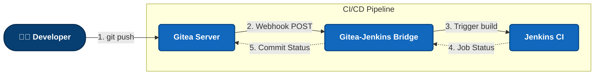

# Gitea-Jenkins Bridge (`gitea-plugin-rs`)

Надёжный, высокопроизводительный и безопасный мост (middleware) на Rust, заменяющий оригинальный Java-плагин `jenkinsci/gitea-plugin`.
Этот сервис маршрутизирует вебхуки от Gitea в Jenkins, а также принимает колбэки от Jenkins о статусах сборок и отправляет их обратно в Gitea. Работает по **Agentless-модели** — устанавливается независимо (например, в Docker) и не требует интеграции в JVM Jenkins'а.

## 🏗 Архитектура

Мост разделен на несколько крейтов для четкого разделения ответственности:
* `webhook-server` — `axum`-сервер, обрабатывающий HTTP-запросы и валидирующий HMAC-подписи (через `X-Gitea-Signature`).
* `bridge-logic` — чистая бизнес-логика трансляции `PushEvent` / `PullRequestEvent` от Gitea во внутреннюю модель `JenkinsTriggerRequest`.
* `jenkins-client` — асинхронный HTTP-клиент, взаимодействующий с Jenkins REST API (используя crumb-issuer).
* `gitea-client` — асинхронный HTTP-клиент, отправляющий статусы сборки (success, failure, pending) в Gitea REST API.



## 🚀 Быстрый запуск (Docker)

Проект изначально оптимизирован для работы в Docker (multi-stage билд на основе `debian:bookworm-slim`). Используется `rustls-tls`, что освобождает контейнер от тяжелых системных зависимостей (OpenSSL).

```bash
# Клонируем репозиторий
git clone https://github.com/kk7453603/GiteaPlugin-rs.git
cd GiteaPlugin-rs

# Запускаем окружение (включает Gitea, Jenkins и webhook-server)
docker compose up -d --build
```

### Переменные окружения (`.env` или `docker-compose.yml`)

Мост настраивается **исключительно** через переменные окружения (UI плагина больше не требуется):

* `SERVER_PORT` — порт веб-сервера (по умолчанию `3000`).
* `GITEA_WEBHOOK_SECRET` — (опционально) секретный токен для проверки HMAC-подписи вебхука Gitea.
* `JENKINS_URL` — базовый URL Jenkins (например, `http://jenkins:8080`).
* `JENKINS_USER` — пользователь Jenkins, имеющий права на запуск сборок.
* `JENKINS_TOKEN` — API-токен Jenkins.
* `JENKINS_JOB` — название джобы в Jenkins для триггера.
* `GITEA_URL` — базовый URL Gitea (например, `http://gitea:3000`).
* `GITEA_TOKEN` — API-токен Gitea с правами на запись статусов коммитов.

## 🛠 Интеграция с Jenkins и Gitea (Руководство по эксплуатации)

### 1. Настройка Jenkins
1. Создайте **Freestyle project** или **Pipeline** с именем `test-job` (или другим, совпадающим с `JENKINS_JOB`).
2. Включите опцию **"This project is parameterized"** (Параметризованная сборка) и добавьте 4 строковых параметра (String Parameter):
   * `BRANCH_NAME` — имя ветки (например, `main`).
   * `COMMIT_SHA` — хеш коммита, вызвавшего вебхук.
   * `GITEA_REPO_URL` — URL репозитория в Gitea.
   * `EVENT_TYPE` — тип события (`push` или `pull_request`).
3. Настройте Jenkins-пайплайн так, чтобы в начале и конце сборки он делал `POST`-запрос на эндпоинт статуса нашего моста:
   ```bash
   # Отправка статуса в bridge-rs
   curl -X POST http://webhook-server:3000/jenkins-status \
        -H "Content-Type: application/json" \
        -d '{
              "repo_owner": "owner",
              "repo_name": "repo",
              "commit_sha": "${COMMIT_SHA}",
              "build_status": "SUCCESS",
              "target_url": "${BUILD_URL}",
              "context": "jenkins/build"
            }'
   ```

### 2. Настройка Gitea
1. Перейдите в настройки вашего репозитория -> **Webhooks**.
2. Нажмите **Add Webhook** -> выберите **Gitea**.
3. Установите **Target URL** на `http://<адрес-вашего-bridge>:3000/gitea-webhook/post`.
4. Установите **HTTP Method** в `POST`.
5. (Опционально) Укажите **Secret**, который совпадает с `GITEA_WEBHOOK_SECRET` в вашем `.env`.
6. В разделе **Trigger On** выберите "Custom Events" и отметьте `Push` и `Pull Request`.

## 🧑‍💻 Разработка и тестирование

Полное руководство для разработчиков доступно в [docs/DEVELOPMENT.md](docs/DEVELOPMENT.md).

### Локальный запуск
Для работы с кодом вам потребуется Rust:
```bash
cargo build
cargo test --all
```

### End-to-End тесты
В директории `scripts` лежат скрипты для проверки E2E интеграции в Docker-контейнерах. Подробнее описано в [DEVELOPMENT.md](docs/DEVELOPMENT.md).

## 🛡 Безопасность и DevOps (Эксплуатация)

Полное руководство по эксплуатации, CI/CD и деплою доступно в [docs/DEPLOYMENT.md](docs/DEPLOYMENT.md).

* Валидация всех вебхуков производится через защищенный от атак по времени алгоритм HMAC-SHA256 (`hmac` + `sha2`).
* Не поддерживаются небезопасные конфигурации с игнорированием сертификатов по умолчанию; все соединения (через `reqwest` + `rustls-tls`) требуют валидного TLS в production.

## 📄 Документация архитектурных решений (ADR)
Все значимые решения по изменению архитектуры документируются в папке `docs/adr/`.
Смотрите [Index ADR](docs/adr/README.md) для деталей.

## 📐 C4 Architecture Diagrams
Визуальная архитектура проекта в формате C4 Model (Context, Container, Component) доступна в [docs/C4_ARCHITECTURE.md](docs/C4_ARCHITECTURE.md).
