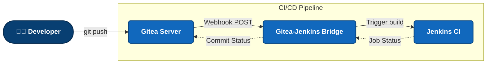
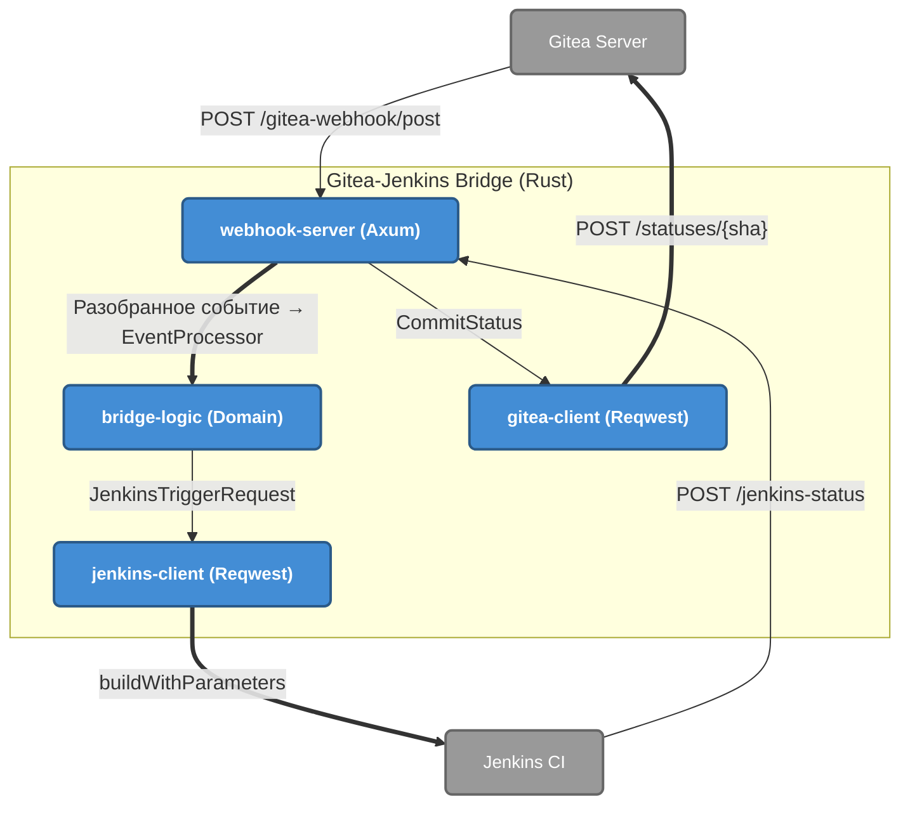
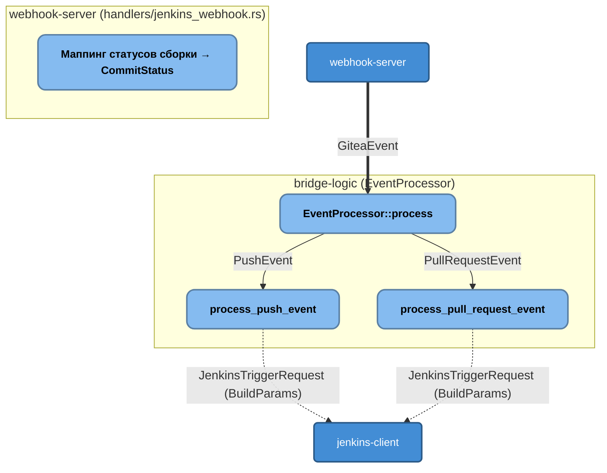

# Архитектура в нотации C4 (C4 Model)

В данном документе описана архитектура моста `gitea-plugin-rs` с использованием подхода [C4 Model](https://c4model.com/), визуализированная через Mermaid.

## Уровень 1: System Context (Контекст системы)
Показывает высокоуровневое взаимодействие системы со своими внешними зависимостями и пользователями.

## Уровень 2: Container (Контейнеры системы)
Раскрывает архитектуру самого моста, показывая его четыре крейта Rust (`webhook-server`, `bridge-logic`, `jenkins-client`, `gitea-client`), запускаемые в одном процессе/контейнере Docker.

**Последовательность стадий потока данных:**

1. **Приём вебхука Gitea** — `webhook-server` принимает `POST /gitea-webhook/post` (`handlers/gitea_webhook.rs`).
2. **Валидация HMAC-подписи** — проверка заголовка `X-Gitea-Signature` (секрет `WEBHOOK_SECRET`); тип события читается из `X-Gitea-Event`.
3. **Трансформация события** — `EventProcessor` (`bridge-logic/src/processor.rs`) преобразует событие Gitea в `JenkinsTriggerRequest` с параметрами `BuildParams`.
4. **Триггер сборки Jenkins** — `jenkins-client` вызывает `buildWithParameters`.
5. **Обратный колбэк статуса в Gitea** — Jenkins шлёт `POST /jenkins-status`; `webhook-server` (`handlers/jenkins_webhook.rs`) маппит статус сборки в `CommitStatus` и через `gitea-client` отправляет `POST /statuses/{sha}`.

## Уровень 3: Component (Компоненты)
Демонстрирует внутреннюю структуру `EventProcessor` (`bridge-logic/src/processor.rs`) и расположение маппинга статусов сборки.

> **Примечание:** Маппинг статусов сборки Jenkins в `CommitStatus` Gitea выполняется **не** в `bridge-logic`, а в обработчике `webhook-server/src/handlers/jenkins_webhook.rs` (функция `handle`), который вызывается на маршруте `POST /jenkins-status`.

> **Примечание:** Уровень 4 (Code) в C4 обычно не рисуется, так как он слишком детализирован, и его роль выполняют UML диаграммы классов или сам исходный код. В Rust эту роль отлично выполняет `cargo doc`.
